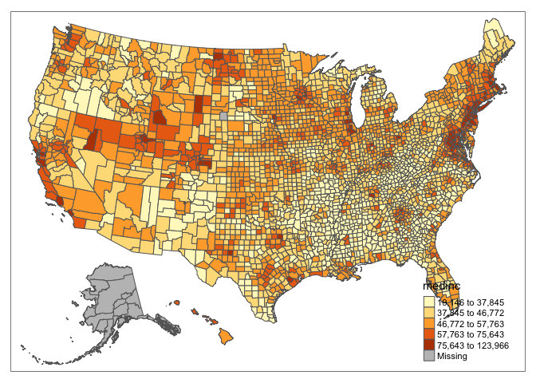

Geog6300: Lab 6
================

## R Markdown

## Regression

**Value:** 30 points

``` r
library(sf)
library(tidyverse)
library(knitr)
library(tmap)
library(lmtest)
library(car)
```

**Overview:** This lab focuses on regression techniques. You’ll be
analyzing the association of county demographics on the presidential
vote in 2012 (the Obama-Romney election).

\###Part 1: Importing data and descriptive statistics### This lab uses
the same county data file you used in Lab 6. You also have a county
shapefile that we’ll use for mapping these results.

**Question 1** *Load the two files in the data folder–the election data
and county level shapefile. Filter the election data for just the 2012
election, then join it to the county shapefile. Call the head of this
data frame using kable when you are done.*

``` r
election_data<-read_csv("data/elections0816_demog_pct.csv") %>%
  filter(year=="2012")
```

    ## Rows: 9332 Columns: 62
    ## ── Column specification ────────────────────────────────────────────────────────
    ## Delimiter: ","
    ## chr  (6): gisjn_cty, county, state, region, division, year_txt
    ## dbl (56): fips_code, year, total, dem, gop, oth, totpop, wht_pop, afam_pop, ...
    ## 
    ## ℹ Use `spec()` to retrieve the full column specification for this data.
    ## ℹ Specify the column types or set `show_col_types = FALSE` to quiet this message.

``` r
county_shp<-st_read("data/US_counties_albersusa.shp") %>%
  left_join(election_data)
```

    ## Reading layer `US_counties_albersusa' from data source 
    ##   `/Users/nick/Downloads/Data science/4300/4300 Lab 6/data/US_counties_albersusa.shp' 
    ##   using driver `ESRI Shapefile'
    ## Simple feature collection with 3143 features and 1 field
    ## Geometry type: MULTIPOLYGON
    ## Dimension:     XY
    ## Bounding box:  xmin: -2100000 ymin: -2500000 xmax: 2516374 ymax: 732103.3
    ## CRS:           unknown

    ## Joining, by = "gisjn_cty"

``` r
kable(head(county_shp))
```

| gisjn_cty | fips_code | county          | state   | region       | division                    | year | year_txt | total |  dem |   gop | oth | totpop | wht_pop | afam_pop | asn_pop | hisp_pop | totpop_ind | indpop_ag | indpop_const | indpop_manuf | indpop_trade | indpop_retail | indpop_transport | indpop_info | indpop_prof | indpop_ed | indpop_arts | indpop_serv | indpop_pubadm | ed_totpop | ed_lesshs | ed_hsdiploma | ed_lessba | ed_ba | ed_graddeg | medinc |  dem_pct |  gop_pct |   oth_pct | wht_pop_pct | afam_pop_pct | asn_pop_pct | hisp_pop_pct | other_pop_pct | indpop_ag_pct | indpop_const_pct | indpop_manuf_pct | indpop_trade_pct | indpop_retail_pct | indpop_transport_pct | indpop_info_pct | indpop_prof_pct | indpop_ed_pct | indpop_arts_pct | indpop_serv_pct | indpop_pubadm_pct | ed_lesshs_pct | ed_hsdiploma_pct | ed_lessba_pct | ed_ba_pct | ed_graddeg_pct | geometry                     |
|:----------|----------:|:----------------|:--------|:-------------|:----------------------------|-----:|:---------|------:|-----:|------:|----:|-------:|--------:|---------:|--------:|---------:|-----------:|----------:|-------------:|-------------:|-------------:|--------------:|-----------------:|------------:|------------:|----------:|------------:|------------:|--------------:|----------:|----------:|-------------:|----------:|------:|-----------:|-------:|---------:|---------:|----------:|------------:|-------------:|------------:|-------------:|--------------:|--------------:|-----------------:|-----------------:|-----------------:|------------------:|---------------------:|----------------:|----------------:|--------------:|----------------:|----------------:|------------------:|--------------:|-----------------:|--------------:|----------:|---------------:|:-----------------------------|
| G01001    |      1001 | Autauga County  | Alabama | South Region | East South Central Division | 2012 | Y2012    | 23909 | 6354 | 17366 | 189 |  55136 |   42033 |    10156 |     500 |     1391 |      39750 |     43555 |        47712 |        42914 |        41833 |         28333 |            50260 |       49554 |       43344 |     40474 |       25409 |       21875 |         53116 |     36233 |      5012 |        12139 |     11132 |  4930 |       3020 |  52475 | 26.57577 | 72.63374 | 0.7904973 |    76.23513 |    18.419907 |   0.9068485 |    2.5228526 |      1.915264 |     109.57233 |        120.03019 |        107.95975 |        105.24025 |          71.27799 |             126.4403 |       124.66415 |       109.04151 |      101.8214 |        63.92201 |        55.03145 |          133.6252 |      13.83269 |         33.50261 |      30.72337 | 13.606381 |       8.334943 | MULTIPOLYGON (((1269841 -13… |
| G01009    |      1009 | Blount County   | Alabama | South Region | East South Central Division | 2012 | Y2012    | 23980 | 2961 | 20741 | 278 |  57645 |   50820 |      847 |      57 |     4880 |      39184 |     40875 |        37447 |        39176 |        38750 |         32076 |            49871 |       32216 |       46566 |     41156 |       16883 |       34320 |         41758 |     39052 |      8567 |        13471 |     12225 |  3174 |       1615 |  44409 | 12.34779 | 86.49291 | 1.1592994 |    88.16029 |     1.469338 |   0.0988811 |    8.4656085 |      1.805881 |     104.31554 |         95.56707 |         99.97958 |         98.89241 |          81.85994 |             127.2739 |        82.21723 |       118.83932 |      105.0327 |        43.08646 |        87.58677 |          106.5690 |      21.93742 |         34.49503 |      31.30441 |  8.127625 |       4.135512 | MULTIPOLYGON (((1240383 -11… |
| G01017    |      1017 | Chambers County | Alabama | South Region | East South Central Division | 2012 | Y2012    | 14562 | 6853 |  7596 | 113 |  34091 |   19651 |    13715 |     214 |      158 |      34334 |     23973 |        34633 |        36061 |        32695 |         27278 |            43496 |       31045 |       35208 |     37875 |       20847 |       22404 |         40373 |     23821 |      5367 |         8885 |      6658 |  1855 |       1056 |  32835 | 47.06084 | 52.16316 | 0.7759923 |    57.64278 |    40.230559 |   0.6277317 |    0.4634654 |      1.035464 |      69.82292 |        100.87086 |        105.03000 |         95.22631 |          79.44894 |             126.6849 |        90.42057 |       102.54558 |      110.3134 |        60.71824 |        65.25310 |          117.5890 |      22.53054 |         37.29902 |      27.95013 |  7.787247 |       4.433063 | MULTIPOLYGON (((1382944 -12… |
| G01021    |      1021 | Chilton County  | Alabama | South Region | East South Central Division | 2012 | Y2012    | 17434 | 3391 | 13910 | 133 |  43781 |   35342 |     4438 |     104 |     3366 |      37696 |     38443 |        36670 |        40205 |        41875 |         30974 |            49440 |       70000 |       31168 |     40186 |       16037 |       29355 |         44184 |     29393 |      6605 |        11753 |      7057 |  2580 |       1398 |  41785 | 19.45050 | 79.78662 | 0.7628771 |    80.72452 |    10.136817 |   0.2375460 |    7.6882666 |      1.212855 |     101.98164 |         97.27823 |        106.65588 |        111.08606 |          82.16787 |             131.1545 |       185.69610 |        82.68251 |      106.6055 |        42.54298 |        77.87298 |          117.2114 |      22.47134 |         39.98571 |      24.00912 |  8.777600 |       4.756234 | MULTIPOLYGON (((1257515 -12… |
| G01033    |      1033 | Colbert County  | Alabama | South Region | East South Central Division | 2012 | Y2012    | 23374 | 9160 | 13931 | 283 |  54491 |   43099 |     8691 |     172 |     1276 |      38220 |     29897 |        42159 |        41227 |        31812 |         28438 |            66504 |       32361 |       36125 |     43543 |       21084 |       34646 |         40488 |     38009 |      6222 |        12851 |     12230 |  4230 |       2476 |  39914 | 39.18884 | 59.60041 | 1.2107470 |    79.09380 |    15.949423 |   0.3156485 |    2.3416711 |      2.299462 |      78.22344 |        110.30612 |        107.86761 |         83.23391 |          74.40607 |             174.0031 |        84.67033 |        94.51858 |      113.9273 |        55.16484 |        90.64887 |          105.9341 |      16.36981 |         33.81041 |      32.17659 | 11.128943 |       6.514247 | MULTIPOLYGON (((1085910 -10… |
| G01045    |      1045 | Dale County     | Alabama | South Region | East South Central Division | 2012 | Y2012    | 18551 | 5283 | 13105 | 163 |  50013 |   35116 |     9528 |     599 |     2929 |      36327 |     32250 |        29811 |        34508 |        42708 |         26382 |            61476 |       45543 |       39012 |     33750 |       21455 |       29032 |         52553 |     33129 |      5062 |        10301 |     12178 |  3709 |       1879 |  44473 | 28.47825 | 70.64309 | 0.8786588 |    70.21374 |    19.051047 |   1.1976886 |    5.8564773 |      3.681043 |      88.77694 |         82.06293 |         94.99271 |        117.56545 |          72.62367 |             169.2295 |       125.36956 |       107.39120 |       92.9061 |        59.06075 |        79.91852 |          144.6665 |      15.27966 |         31.09360 |      36.75933 | 11.195629 |       5.671768 | MULTIPOLYGON (((1382203 -13… |

For this analysis, you’ll be looking at the following variables:

-   gop_pct: The % of vote for Romney (the Republican) in 2012
-   medinc: Median household income
-   wht_pop_pct: % of population classified as white
-   ed_graddeg_pct: % of the population whose highest educational
    attainment is a graduate degree.

You’ll be evaluating how each of the last three variables was associated
with the county’s Republican vote in 2012. To start with, you should
assess the distribution of each variable.

**Question 2** *Create a QQ plot for each of the four variables of
interest. Based on these graphs, assess the normality of these
variables.*

``` r
ggplot(county_shp,aes(sample=gop_pct)) +
  stat_qq()+
  stat_qq_line()
```

    ## Warning: Removed 32 rows containing non-finite values (stat_qq).

    ## Warning: Removed 32 rows containing non-finite values (stat_qq_line).

<!-- -->

``` r
ggplot(county_shp,aes(sample=medinc)) +
  stat_qq()+
  stat_qq_line()
```

    ## Warning: Removed 32 rows containing non-finite values (stat_qq).
    ## Removed 32 rows containing non-finite values (stat_qq_line).

<!-- -->

``` r
ggplot(county_shp,aes(sample=wht_pop_pct)) +
  stat_qq()+
  stat_qq_line()
```

    ## Warning: Removed 32 rows containing non-finite values (stat_qq).
    ## Removed 32 rows containing non-finite values (stat_qq_line).

<!-- -->

``` r
ggplot(county_shp,aes(sample=ed_graddeg_pct)) +
  stat_qq()+
  stat_qq_line()
```

    ## Warning: Removed 32 rows containing non-finite values (stat_qq).
    ## Removed 32 rows containing non-finite values (stat_qq_line).

<!-- -->

{Each of the four variables deviate from the line of normativity, and
are thus non-normal.}

**Question 3** *Use tmap to map the four variables of interest using
Jenks natural breaks as the classification method For an extra, optional
challenge, you can dissolve the counties to state boundaries using
group_by (with the state variable)and summarise. Add these boundaries to
your maps and reduce the opacity of the county boundaries using the
border.alpha parameter.*

``` r
tm_shape(county_shp)+
  tm_polygons("gop_pct", style="jenks")
```

    ## Use "fisher" instead of "jenks" for larger data sets

<!-- -->

``` r
tm_shape(county_shp)+
  tm_polygons("wht_pop_pct", style="jenks")
```

    ## Use "fisher" instead of "jenks" for larger data sets

<!-- -->

``` r
tm_shape(county_shp)+
  tm_polygons("medinc", style="jenks")
```

<!-- -->

``` r
tm_shape(county_shp)+
  tm_polygons("ed_graddeg_pct", style="jenks")
```

    ## Use "fisher" instead of "jenks" for larger data sets

<!-- -->

``` r
tm_shape(county_shp)+
  tm_polygons(c("gop_pct", "medinc", "wht_pop_pct", "ed_graddeg_pct"),style="jenks")
```

    ## Use "fisher" instead of "jenks" for larger data sets
    ## Use "fisher" instead of "jenks" for larger data sets
    ## Use "fisher" instead of "jenks" for larger data sets

<!-- -->

**Question 4** *Based on the maps from question 3, summarise two major
patterns you see in the spatial distribution of these data from any of
your variables of interest. Be sure to make specific references to your
data to illustrate your points.*

{Major pattern \#1: there appears to be a positive association between
wht_pop_pct and gop_pct; as wht_pop_pct increases, gop_pct relatively
coincides as well

Major pattern \#2: there also appears to be a positive association
between medinc and gop_pct; the areas of the highest medinc also
coincide with higher gop_pct values.}

**Question 5** *Create univariate regression models for each of the
independent variables (income, % white, and % w/graduate degree) using %
voting GOP as the dependent variable. Make sure the results of each
model are visible.*

``` r
lm(gop_pct~medinc, data=county_shp) 
```

    ## 
    ## Call:
    ## lm(formula = gop_pct ~ medinc, data = county_shp)
    ## 
    ## Coefficients:
    ## (Intercept)       medinc  
    ##   6.382e+01   -8.674e-05

``` r
model<-lm(gop_pct~medinc, data=county_shp)
summary(model)
```

    ## 
    ## Call:
    ## lm(formula = gop_pct ~ medinc, data = county_shp)
    ## 
    ## Residuals:
    ##     Min      1Q  Median      3Q     Max 
    ## -52.527  -8.876   0.997  10.268  36.773 
    ## 
    ## Coefficients:
    ##               Estimate Std. Error t value Pr(>|t|)    
    ## (Intercept)  6.382e+01  1.056e+00  60.421  < 2e-16 ***
    ## medinc      -8.674e-05  2.205e-05  -3.934 8.55e-05 ***
    ## ---
    ## Signif. codes:  0 '***' 0.001 '**' 0.01 '*' 0.05 '.' 0.1 ' ' 1
    ## 
    ## Residual standard error: 14.7 on 3109 degrees of freedom
    ##   (32 observations deleted due to missingness)
    ## Multiple R-squared:  0.004952,   Adjusted R-squared:  0.004632 
    ## F-statistic: 15.47 on 1 and 3109 DF,  p-value: 8.554e-05

``` r
lm(gop_pct~wht_pop_pct, data=county_shp) 
```

    ## 
    ## Call:
    ## lm(formula = gop_pct ~ wht_pop_pct, data = county_shp)
    ## 
    ## Coefficients:
    ## (Intercept)  wht_pop_pct  
    ##     34.7791       0.3213

``` r
model1<-lm(gop_pct~wht_pop_pct, data=county_shp)
summary(model1)
```

    ## 
    ## Call:
    ## lm(formula = gop_pct ~ wht_pop_pct, data = county_shp)
    ## 
    ## Residuals:
    ##     Min      1Q  Median      3Q     Max 
    ## -41.474  -9.443   0.123   9.411  40.849 
    ## 
    ## Coefficients:
    ##             Estimate Std. Error t value Pr(>|t|)    
    ## (Intercept) 34.77915    0.97853   35.54   <2e-16 ***
    ## wht_pop_pct  0.32129    0.01218   26.37   <2e-16 ***
    ## ---
    ## Signif. codes:  0 '***' 0.001 '**' 0.01 '*' 0.05 '.' 0.1 ' ' 1
    ## 
    ## Residual standard error: 13.32 on 3109 degrees of freedom
    ##   (32 observations deleted due to missingness)
    ## Multiple R-squared:  0.1828, Adjusted R-squared:  0.1825 
    ## F-statistic: 695.3 on 1 and 3109 DF,  p-value: < 2.2e-16

``` r
lm(gop_pct~ed_graddeg_pct, data=county_shp) 
```

    ## 
    ## Call:
    ## lm(formula = gop_pct ~ ed_graddeg_pct, data = county_shp)
    ## 
    ## Coefficients:
    ##    (Intercept)  ed_graddeg_pct  
    ##         69.096          -1.346

``` r
model2<-lm(gop_pct~ed_graddeg_pct, data=county_shp)
summary(model2)
```

    ## 
    ## Call:
    ## lm(formula = gop_pct ~ ed_graddeg_pct, data = county_shp)
    ## 
    ## Residuals:
    ##     Min      1Q  Median      3Q     Max 
    ## -52.690  -8.512   0.931   9.318  39.863 
    ## 
    ## Coefficients:
    ##                Estimate Std. Error t value Pr(>|t|)    
    ## (Intercept)     69.0960     0.4852  142.40   <2e-16 ***
    ## ed_graddeg_pct  -1.3457     0.0606  -22.21   <2e-16 ***
    ## ---
    ## Signif. codes:  0 '***' 0.001 '**' 0.01 '*' 0.05 '.' 0.1 ' ' 1
    ## 
    ## Residual standard error: 13.69 on 3109 degrees of freedom
    ##   (32 observations deleted due to missingness)
    ## Multiple R-squared:  0.1369, Adjusted R-squared:  0.1366 
    ## F-statistic: 493.1 on 1 and 3109 DF,  p-value: < 2.2e-16

**Question 6** *Summarize the results of the models in question 5,
focusing on the direction and significance of the model coefficients,
the normality of model residuals, and the overall R2 value.*

{R2 values are low for each; Medinc/ed_graddeg_pct coefficients each
significantly negative, moderately positive coefficient for wht_pop_pct.
Model residuals are relativel minimal for each, signifying minimal error
between model prediction and actual results.}

**Question 7** *Create a multivariate regression model with all three
variables of interest and call the results.*

``` r
model_all<-lm(gop_pct~ed_graddeg_pct+medinc+wht_pop_pct,data=county_shp)
summary(model_all)
```

    ## 
    ## Call:
    ## lm(formula = gop_pct ~ ed_graddeg_pct + medinc + wht_pop_pct, 
    ##     data = county_shp)
    ## 
    ## Residuals:
    ##     Min      1Q  Median      3Q     Max 
    ## -32.262  -8.671   0.178   8.598  39.456 
    ## 
    ## Coefficients:
    ##                  Estimate Std. Error t value Pr(>|t|)    
    ## (Intercept)     4.018e+01  1.165e+00  34.480  < 2e-16 ***
    ## ed_graddeg_pct -1.554e+00  6.666e-02 -23.309  < 2e-16 ***
    ## medinc          1.572e-04  2.275e-05   6.912 5.78e-12 ***
    ## wht_pop_pct     2.961e-01  1.134e-02  26.119  < 2e-16 ***
    ## ---
    ## Signif. codes:  0 '***' 0.001 '**' 0.01 '*' 0.05 '.' 0.1 ' ' 1
    ## 
    ## Residual standard error: 12.18 on 3107 degrees of freedom
    ##   (32 observations deleted due to missingness)
    ## Multiple R-squared:  0.3175, Adjusted R-squared:  0.3168 
    ## F-statistic: 481.8 on 3 and 3107 DF,  p-value: < 2.2e-16

**Question 8** *Summarise the results of the multivariate model. What
are the direction, magnitude, and significance of each coefficient, and
how did it change from the univariate models (if at all)? What do the R2
and F-statistic values tell you about overall model fit?*

{Coefficients for ed_graddeg_pct remained negative; medinc coefficient
became positive, and wht_pop_pct coefficient remained significantly
positive. R2 reveals that \~0.317 (\~32%) of the variability observed in
the target variable is explained by the regression model. F-statistic
(with p-value) tells us that our results are signifcant.}

**Question 9** *Use a QQ plot and a map to assess the normality of
residuals and any spatial autocorrelation. Summarise any notable
patterns that you see.*

``` r
election_data$residuals<-residuals(model_all)
ggplot(election_data,aes(sample=residuals))+
  stat_qq()+stat_qq_line()
```

<!-- -->

{Residuals fail to follow the line of normativity, and are thus
non-normal.}

**Question 10** *Assess any issues with multicollinearity or
heteroskedastity in this model using the techniques shown in class. Run
the appropriate tests and explain what their results show you.*

``` r
bptest(model_all)
```

    ## 
    ##  studentized Breusch-Pagan test
    ## 
    ## data:  model_all
    ## BP = 48.948, df = 3, p-value = 1.338e-10

``` r
vif(model_all)
```

    ## ed_graddeg_pct         medinc    wht_pop_pct 
    ##       1.529070       1.550021       1.035575

{p-value \< 0.05, therefore reject null hypothesis of uniformity

VIF values all below 5, non-problematic amount of collinearity}

**Question 11** *Looking at the full model and your diagnostics, do you
feel this is a model that provides meaningful results? Explain your
answer.*

{Yes, it does. There is a non-problematic amount of collinearity, there
is minimal error between model prediction and actual results,
correlation coefficients and f-statistic yeilded signifcant results, and
visualizations of models depict notable patterns.}

**Lab reflection:** *How do you feel about the work you did on this lab?
Was it easy, moderate, or hard? What were the biggest things you learned
by completing it?*

{I’d say that I feel least confident about this lab, compared to our
others. It was hard from a conceptual standpoint, and interpreting these
tests and results certianly is not my strong suit. I’m quite burnt out
at this point of the semester and while my work here leaves much to be
desired, I’m simply happy to have put forth the effort to get things
done. I learned most about regression analyses and interpreting their
results. }

**Bonus challenge** There’s lots of controversy over election maps, as
choropleth versions can overemphaize land area compared to population.
For this bonus challenge, map some aspect of these election results (for
example, gop or dem vote, the margin between them, or any other variable
you might create) using one of the following techniques:

-   Cartograms:
    <https://cran.r-project.org/web/packages/cartogram/readme/README.html>
-   Dot density maps: <https://rpubs.com/mathetal/dotdensity>
-   Bivariate maps (maybe with a demographic variable):
    <https://cran.r-project.org/web/packages/biscale/vignettes/biscale.html>

Alternatively, create your own visualization of these election data
using ggplot that isn’t a choropleth map (or even a map at all). Post
your map below and explain what you like about it.

``` r
#Code goes here
```

{Interpretation goes here.}
